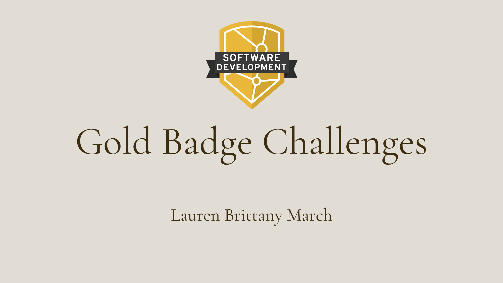

# Gold Badge Console Application Challenges

The Gold Badge Challenges are projects designed by Eleven Fifty Academy to evaluate a student's progress in the Software Development program. There are 8 challenges available, I have chosen three to complete and showcase. The challenges were completed in C# using Visual Studio Community. Each challenge is contained in a single Solution.

I have completed the following challenges:

* Challenge 1: Komodo Cafe
* Challenge 3: Komodo Insurance Badges
* Challenge 4: Komodo Company Outings
 

## Challenge One: The Komodo Cafe
This challenge for the "Komodo Cafe" involved creating an application that allowed the manager to create new menu items, delete menu items, and receive a list of all of the item's on the cafe's menu. Each menu item had asigned properties including a meal name and number, a description of the item, a list of ingredients, and the sale price.

By creating a "Menu Item" object, I assigned it properties and made badic CRUD operations in the "Menu Item" Repository. In the UI, the user is able to choose a selection from a menu to create, delete, and view menu items.

## Challenge Three: Komodo Insurance Badges
This challenge for "Komodo Insurance" involved creating an application for their Security Admin to  
## Challenge Four: Komody Comapny Outings

## What's Next?

## Link Example
[Lauren March]
